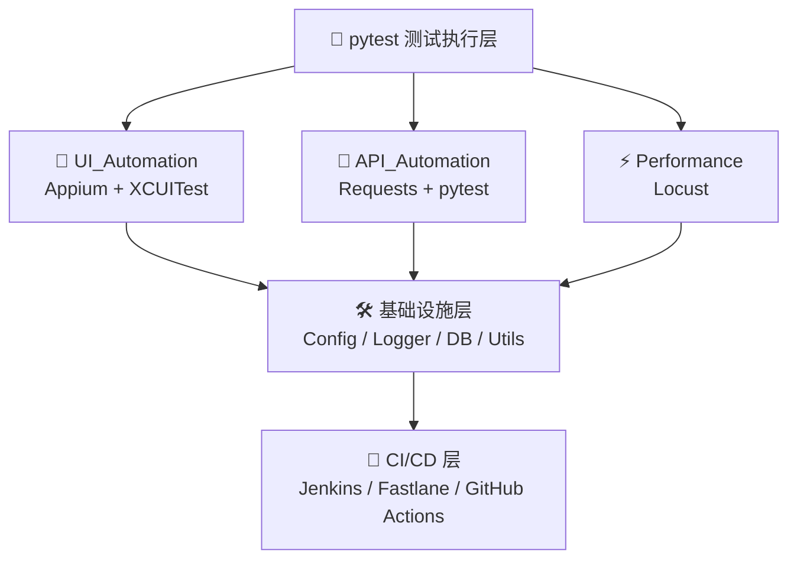

# 🧪 iOS-Automation-Framework

> **基于云鹿商城的移动端自动化测试框架** | Appium + pytest + Allure + Jenkins CI/CD


---

## 📋 项目简介

本项目是一个完整的 **iOS 移动端自动化测试框架**，以**云鹿商城 App** 为测试对象，实现了 **UI 自动化测试**、**接口自动化测试**、**性能测试** 三位一体的测试解决方案。

### 核心特性

| 特性 | 说明 |
|------|------|
| 🎯 **Page Object 模式** | UI 层与业务逻辑解耦，易于维护 |
| 📊 **数据驱动测试** | YAML 管理测试数据，支持多环境切换 |
| 🔌 **接口/UI 联动** | 统一框架同时支持 API 和 UI 测试 |
| 📈 **Allure 报告** | 可视化测试报告，支持历史趋势 |
| 🔄 **Jenkins CI/CD** | 自动化流水线，每日构建执行 |
| ⚡ **性能测试** | 基于 Locust 的压力测试脚本 |

---

## 🏗️ 技术架构



---

## 📁 项目结构

```
iOS-Automation-Framework/
├── README.md                      # 项目说明文档
├── requirements.txt               # Python 依赖
├── pytest.ini                     # pytest 配置
├── conftest.py                    # 全局 fixtures
│
├── config/                        # 🔧 配置层
│   ├── __init__.py
│   ├── settings.py                # 全局配置
│   └── environments.yaml          # 多环境配置
│
├── utils/                         # 🛠️ 工具层
│   ├── __init__.py
│   ├── log_util.py               # 日志工具
│   ├── request_util.py           # HTTP 请求工具
│   ├── assertion_util.py         # 断言工具
│   ├── db_util.py                # 数据库工具
│   └── screenshot_util.py        # 截图工具
│
├── UI_Automation/                 # 📱 UI 自动化 (Appium)
│   ├── Pages/                    # Page Object 页面对象
│   │   ├── __init__.py
│   │   ├── base_page.py          # 基础页面类
│   │   ├── login_page.py         # 登录页
│   │   ├── home_page.py          # 首页
│   │   ├── category_page.py      # 分类页
│   │   ├── product_detail_page.py # 商品详情页
│   │   ├── cart_page.py          # 购物车页
│   │   └── order_page.py         # 订单页
│   ├── Tests/                    # UI 测试用例
│   │   ├── __init__.py
│   │   ├── test_login.py         # 登录模块测试
│   │   ├── test_home.py          # 首页功能测试
│   │   ├── test_search.py        # 搜索功能测试
│   │   ├── test_cart.py          # 购物车功能测试
│   │   └── test_order.py         # 订单流程测试
│   ├── screenshots/              # 失败截图
│   └── conftest.py               # UI fixtures
│
├── API_Automation/                # 🔌 接口自动化
│   ├── api/                      # API 封装层
│   │   ├── __init__.py
│   │   ├── base_api.py           # 基础 API 类
│   │   ├── user_api.py           # 用户模块 API
│   │   ├── product_api.py        # 商品模块 API
│   │   ├── cart_api.py           # 购物车 API
│   │   └── order_api.py          # 订单 API
│   ├── cases/                    # 接口测试用例
│   │   ├── __init__.py
│   │   ├── test_user.py          # 用户接口测试
│   │   ├── test_product.py       # 商品接口测试
│   │   ├── test_cart.py          # 购物车接口测试
│   │   └── test_order.py         # 订单接口测试
│   ├── data/                     # 测试数据
│   │   ├── user_data.yaml        # 用户测试数据
│   │   ├── product_data.yaml     # 商品测试数据
│   │   └── order_data.yaml       # 订单测试数据
│   └── utils/
│       └── data_loader.py        # YAML 数据加载器
│
├── Performance/                   # ⚡ 性能测试
│   └── locust_scripts/
│       ├── __init__.py
│       ├── locustfile.py         # Locust 性能测试入口
│       └── api_scenarios.py      # API 压力场景
│
├── CI/                            # 🚀 CI/CD 配置
│   ├── jenkins/
│   │   └── Jenkinsfile           # Jenkins Pipeline
│   └── fastlane/
│       └── Fastfile              # Fastlane 配置
│
├── Reports/                       # 📊 测试报告输出
│   └── .gitkeep
│
└── docs/                          # 📖 文档
    ├── design.md                 # 设计思路文档
    └── api_interface.md          # API 接口文档
```

---

## 🚀 快速开始

### 环境要求

- **Python**: 3.9+
- **Node.js**: 16+ (Appium 需要)
- **Xcode**: 14+ (iOS 模拟器)
- **Java**: JDK 11+ (Appium Server)

### 安装步骤

```bash
# 1. 克隆项目
git clone https://github.com/your-username/iOS-Automation-Framework.git
cd iOS-Automation-Framework

# 2. 创建虚拟环境
python -m venv venv
source venv/bin/activate  # macOS/Linux
# 或 venv\Scripts\activate  # Windows

# 3. 安装依赖
pip install -r requirements.txt

# 4. 安装 Appium
npm install -g appium
appium driver install xcuitest

# 5. 配置本地环境
cp config/local.yml.example config/local.yml
# 编辑 local.yml，填入你的设备名、App 路径和测试账号
```

### 运行测试

```bash
# ====== 运行接口自动化测试 ======
# 运行所有接口测试
pytest API_Automation/cases -v --alluredir=./Reports/api-results

# 运行指定模块
pytest API_Automation/cases/test_user.py -v

# 运行并生成 Allure 报告
pytest API_Automation/cases -v --alluredir=./Reports/api-results
allure generate ./Reports/api-results -o ./Reports/api-report --clean

# ====== 运行 UI 自动化测试 ======
# 启动 Appium Server（新终端）
appium

# 运行 UI 测试
pytest UI_Automation/Tests -v --alluredir=./Reports/ui-results \
  --driver-remote-url=http://127.0.0.1:4723

# ====== 运行性能测试 ======
cd Performance/locust_scripts
locust -f locustfile.py --host=https://api.yunlu.com
```

---

## 🎨 设计思路

### 为什么选择 Page Object 模式？

**问题**：传统线性脚本的维护成本极高，UI 变更需要修改大量测试代码。

**方案**：Page Object 模式将每个页面抽象为一个对象：
- **元素定位**集中在 Page 类中
- **业务操作**封装为 Page 方法
- **测试用例**只关注业务流程，不关心元素细节

**优势**：UI 变更只需修改对应的 Page 类，不影响测试用例。

### 为什么选择 Appium + pytest？

| 维度 | 选择 | 理由 |
|------|------|------|
| UI 框架 | Appium | 跨平台、生态成熟、社区活跃 |
| 测试框架 | pytest | fixture 强大、参数化便捷、插件丰富 |
| 报告系统 | Allure | 可视化好、支持历史对比、便于分享 |
| 数据驱动 | YAML + parametrize | 数据与代码分离，非技术人员可维护 |

### 如何保证测试稳定性？

1. **显式等待**：替代 `sleep()` 和隐式等待，使用 `WebDriverWait` 精确控制
2. **多策略元素定位**：优先 Accessibility ID → XPath → Predicate → Class Chain
3. **重试机制**：`pytest-rerunfailures` 失败自动重试
4. **失败截图**：每次失败自动截图 + 日志记录
5. **数据隔离**：每条用例独立数据，避免状态污染

---

## 📊 测试覆盖范围

### UI 自动化（云鹿商城）

| 模块 | 功能点 | 用例数 |
|------|--------|--------|
| 登录模块 | 手机号登录、验证码、密码登录 | 15 |
| 首页 | Banner 轮播、分类导航、推荐商品 | 12 |
| 分类 | 分类列表、筛选排序、商品卡片 | 10 |
| 商品详情 | 图片预览、规格选择、加入购物车 | 18 |
| 购物车 | 数量修改、删除、结算 | 14 |
| 订单 | 提交订单、支付、订单列表 | 20 |
| **合计** | | **89** |

### 接口自动化

| 模块 | 接口数 | 用例数 |
|------|--------|--------|
| 用户模块 | 8 | 32 |
| 商品模块 | 12 | 48 |
| 购物车模块 | 6 | 24 |
| 订单模块 | 10 | 40 |
| **合计** | **36** | **144** |

---

## 🔧 核心代码示例

### Page Object 示例

```python
# UI_Automation/Pages/login_page.py
class LoginPage(BasePage):
    """云鹿商城 - 登录页"""
    
    # 元素定位
    _PHONE_INPUT = (MobileBy.ACCESSIBILITY_ID, "phone_input")
    _CODE_INPUT = (MobileBy.ACCESSIBILITY_ID, "code_input")
    _LOGIN_BTN = (MobileBy.ACCESSIBILITY_ID, "login_button")
    _AGREE_CHECKBOX = (MobileBy.XPATH, "//XCUIElementTypeSwitch")
    
    def input_phone(self, phone: str):
        """输入手机号"""
        self.wait_and_input(self._PHONE_INPUT, phone)
        return self
    
    def input_code(self, code: str):
        """输入验证码"""
        self.wait_and_input(self._CODE_INPUT, code)
        return self
    
    def click_login(self):
        """点击登录按钮"""
        self.wait_and_click(self._LOGIN_BTN)
        return HomePage(self.driver)
    
    def login(self, phone, code):
        """完整登录流程"""
        return (self.input_phone(phone)
                   .input_code(code)
                   .click_login())
```

### 数据驱动测试示例

```yaml
# API_Automation/data/user_data.yaml
login_cases:
  - name: 正常手机号登录
    phone: "13800138000"
    code: "123456"
    expected_code: 0
    expected_msg: "success"
    
  - name: 错误的手机号格式
    phone: "123"
    code: "123456"
    expected_code: 1001
    expected_msg: "手机号格式错误"
    
  - name: 错误验证码
    phone: "13800138000"
    code: "000000"
    expected_code: 1002
    expected_msg: "验证码错误"
```

---

## 📈 Jenkins CI/CD 集成

项目内置了完整的 Jenkins Pipeline 配置：

1. **Checkout** → 从 Git 拉取最新代码
2. **Install Dependencies** → pip install -r requirements.txt  
3. **Run API Tests** → 执行接口自动化
4. **Run UI Tests** → 执行 UI 自动化
5. **Generate Report** → 生成 Allure 报告
6. **Notify** → 钉钉/企业微信通知结果

详细配置请参考 `CI/jenkins/Jenkinsfile`。

---

## 🤝 贡献指南

1. Fork 本仓库
2. 创建特性分支 (`git checkout -b feature/amazing-feature`)
3. 提交更改 (`git commit -m 'Add amazing feature'`)
4. 推送到分支 (`git push origin feature/amazing-feature`)
5. 开启 Pull Request

---

## 📄 License

MIT License © 2024

---

## 👨‍💻 作者

iOS 开发工程师，关注工程质量与交付效率。本项目源于对移动端自动化测试体系的系统性思考——从 Page Object 设计、接口分层到 CI/CD 落地，记录完整的工程实践过程。
